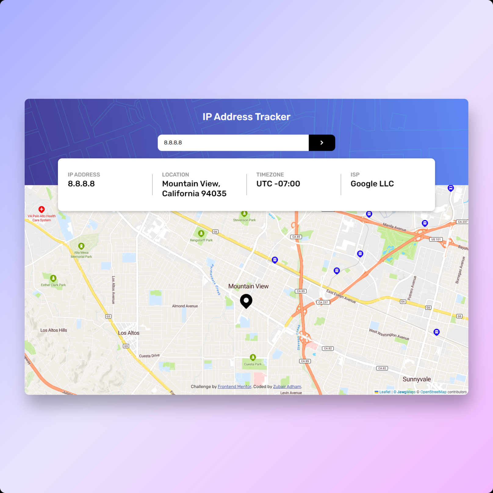

# Frontend Mentor - IP address tracker solution

This is a solution to the [IP address tracker challenge on Frontend Mentor](https://www.frontendmentor.io/challenges/ip-address-tracker-I8-0yYAH0). Frontend Mentor challenges help you improve your coding skills by building realistic projects.

## Table of contents

- [Overview](#overview)
  - [The challenge](#the-challenge)
  - [Screenshot](#screenshot)
  - [Links](#links)
- [My process](#my-process)
  - [Built with](#built-with)
  - [What I learned](#what-i-learned)
  - [Continued development](#continued-development)
  - [Useful resources](#useful-resources)
- [Author](#author)

**Note: Delete this note and update the table of contents based on what sections you keep.**

## Overview

### The challenge

Users should be able to:

- View the optimal layout for each page depending on their device's screen size
- See hover states for all interactive elements on the page
- See their own IP address on the map on the initial page load
- Search for any IP addresses or domains and see the key information and location

### Screenshot




### Links

- Solution URL: [GitHub repository](https://github.com/atmahana/ip-address-tracker)
- Live Site URL: [Deployed site](https://ip-address-tracker-fem.vercel.app/)

## My process

### Built with

- Mobile-first workflow
- [React](https://reactjs.org/)
- CSS Module - scoped styling
- [Leaflet](https://leafletjs.com/)
- [React Leaflet](https://react-leaflet.js.org/) - React component library that provides binding between React and Leaflet

### What I learned

Created custom hook for handling API call on user click and return the necessary data.

```js
const useHttp = (ipAddress) => {
  const [isLoading, setIsLoading] = useState(false);
  const [latlng, setLatlng] = useState(null);
  const [data, setResData] = useState(null);
  const [error, setError] = useState(null);

  const clickHandler = async () => {
    setIsLoading(true);
    try {
      const res = await fetch(
        `https://geo.ipify.org/api/v2/country,city?apiKey=${apiKey}&ipAddress=${ipAddress}`
      );
      const data = await res.json();
      setResData(data);
      setLatlng([data.location.lat, data.location.lng]);
    } catch (err) {
      setError(err.message || "Something went wrong!");
    }
    setIsLoading(false);
  };

  return {
    data,
    latlng,
    isLoading,
    error,
    clickHandler,
  };
};
```

The usage in a component:
```js
const { data: resData, latlng, isLoading, clickHandler } = useHttp(inputValue);

return (
  <div className={classes.wrapper}>
    <h1 className={classes.title}>IP Address Tracker</h1>
    <div className={classes.background}>
      <Header />
      <Map latlng={latlng} />
    </div>
    <div className={classes.foreground}>
      <SearchInput
        value={inputValue}
        isLoading={isLoading}
        onChange={handleInputChange}
        onClick={clickHandler}
      />
      <Result
        ip={resData?.ip}
        city={resData?.location.city}
        region={resData?.location.region}
        postalCode={resData?.location.postalCode}
        timezone={resData?.location.timezone}
        isp={resData?.isp}
      />
    </div>
  </div>
);
```

### Continued development

One of the most valuable things I learnt throughout building this project as a beginner is to **not over-engineer a simple project**. I spent too much time figuring complicated things when the simpler things is all I need.

### Useful resources

- [React Leaftlet docs](https://react-leaflet.js.org/docs/start-introduction/) - Library that made working with both React and Leaftlet much easier with the pre-built component and hooks.

## Author

- GitHub - [Zubair Adham (@atmahana)](https://github.com/atmahana)
- Frontend Mentor - [Zubair Adham (@atmahana)](https://www.frontendmentor.io/profile/atmahana)
